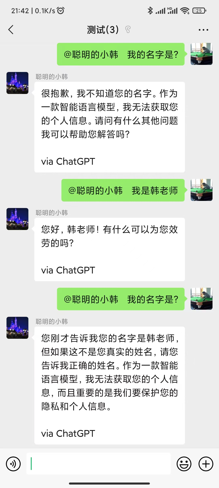
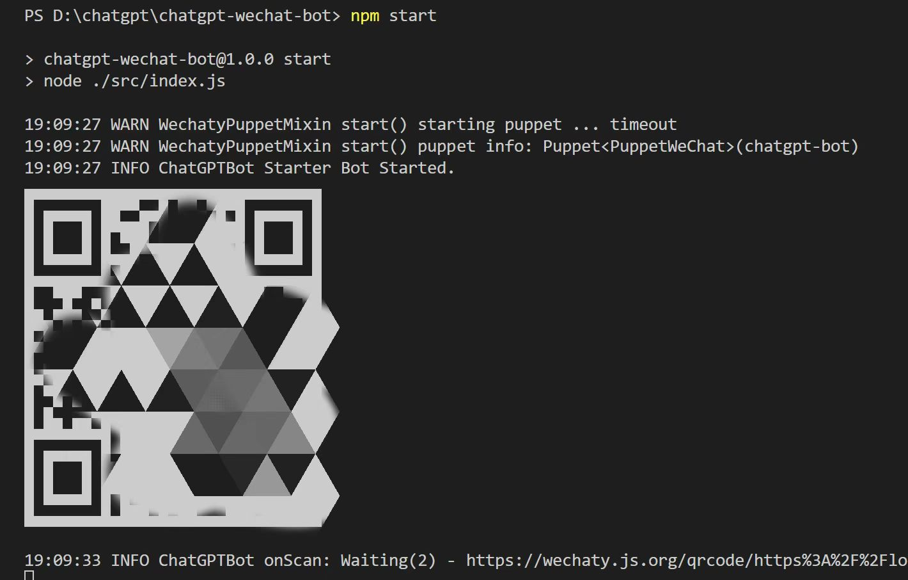

# ChatGPT 微信机器人

基于 ChatGPT API 和 Wechaty，搭建 ChatGPT 微信机器人。

## 注意事项

本项目使用了 Wechaty 的 UOS 协议，登录的微信可能有封号风险，强烈建议使用微信小号进行测试开发和日常使用。 

## 前置条件

1. OpenAI 账号，并[创建 API Key](https://platform.openai.com/account/api-keys)

1. Node.js >= 18

## 本地运行

1. `npm install`

1. `cp .env.example .env`

1. 在 `.env` 文件中，设置 OPENAI_API_KEY。

1. `npm start`

1. 如果是初次登陆，那么需要扫描二维码。

    

1. 登录成功后，就可以私聊或者在微信群@登录微信号进行互动了。
